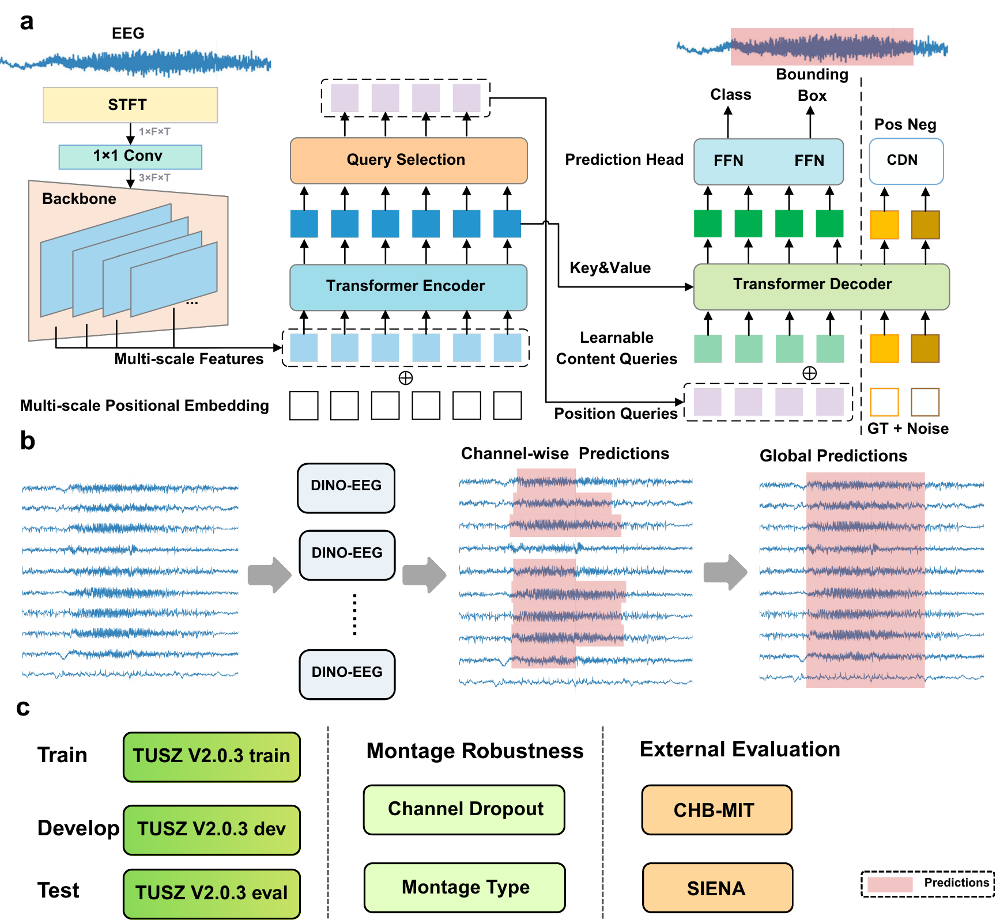

# DINO-EEG: Event-level, montage-robust seizure detection in clinical EEG

This project provides an end-to-end pipeline for epileptic event detection from EEG data. It covers preprocessing raw EDF EEG recordings into spectral features (STFT), applying a modified DINO object detection model for seizure detection, and supporting evaluation, result merging, and visualization.

The model training and evaluation code is under `2_dino_eeg/`.

## Overview

The figure below provides a compact overview of the pipeline and outputs. The full PDF version is available at [`Overview.pdf`](Overview.pdf).



---

## Quick Start

* **Recommended environment**: Python 3.11, CUDA 12.4, PyTorch >= 2.2 (examples use 2.5.1)
* **Installation steps**:

  1. Install PyTorch / torchvision according to your CUDA version.

     ```bash
     pip install torch==2.5.1 torchvision==0.20.1 torchaudio==2.5.1 --index-url https://download.pytorch.org/whl/cu124
     ```

  2. Install DINO-EEG dependencies:

     ```bash
     pip install -r 2_dino_eeg/requirements.txt
     ```

  3. Install additional libraries required for evaluation:

     ```bash
     # EEG dataset conversion to BIDS format, EDF/annotation handling
     pip install -U epilepsy2bids

     # Event-level / sample-level performance metrics
     pip install -U timescoring
     ```

---

## Data Preparation

The project supports multiple datasets. Below we illustrate the typical workflow using **TUSZ** as an example. Adjust paths according to your local data locations.

### TUSZ v2.0.3

1. **Preprocessing** (from raw EDF to task-specific preprocessed data):

```bash
python 2_dino_eeg/datasets/tusz/preprocess_wo_slice.py \
  --raw_edf_dir Raw_TUSZ_Dir/train/ --save_dir Preprocess_Data_Dir/train/
python 2_dino_eeg/datasets/tusz/preprocess_wo_slice.py \
  --raw_edf_dir Raw_TUSZ_Dir/dev/   --save_dir Preprocess_Data_Dir/dev/
python 2_dino_eeg/datasets/tusz/preprocess_wo_slice.py \
  --raw_edf_dir Raw_TUSZ_Dir/eval/  --save_dir Preprocess_Data_Dir/eval/
```

2. **STFT transformation** (magnitude scaling + cropping):

```bash
python 2_dino_eeg/datasets/common/transform.py \
  --data_dir Preprocess_Data_Dir/train/ --save_dir STFT_Data_Dir/train/ --scale --crop
python 2_dino_eeg/datasets/common/transform.py \
  --data_dir Preprocess_Data_Dir/dev/   --save_dir STFT_Data_Dir/dev/   --scale --crop
python 2_dino_eeg/datasets/common/transform.py \
  --data_dir Preprocess_Data_Dir/eval/  --save_dir STFT_Data_Dir/eval/  --scale --crop
```

3. **Generate `.txt` files required for training and copy them to the TXT directory**:

```bash
python 2_dino_eeg/datasets/tusz/filter_and_sort.py <parent directory of STFT_Data_Dir>
```

---

### CHB-MIT

1. **Parse labels from text files**:

```bash
python 2_dino_eeg/datasets/chbmit/make_label.py Raw_CHBMIT_Dir Label_Save_Dir
```

2. **Preprocessing**:

```bash
python 2_dino_eeg/datasets/chbmit/preprocess.py \
  --raw_edf_dir Raw_CHBMIT_Dir --preprocessed_label_dir Label_Save_Dir --save_dir Preprocess_Data_Dir
```

3. **STFT transformation and `.txt` generation** follow the same steps as TUSZ.

---

## Training

You can run training directly using scripts, or execute them via the Python command line on Windows.

Example Bash training script:

```bash
2_dino_eeg/scripts/DINO_train_swin_tusz.sh
```

---

## Evaluation

Evaluate trained checkpoints using scripts such as:

```bash
2_dino_eeg/scripts/DINO_eval_tusz.sh
```

---

## End-to-End Inference for a Single EDF

Use the one-click script to perform preprocessing -> model inference -> multi-channel merging -> event-level TSV export:

```bash
python run_edf_to_tcp_predictions.py \
  --edf_path /path/to/file.edf \
  --checkpoint_path /path/to/checkpoint.pth \
  --device cuda:0 \
  --threshold 0.35
```

* **Generated directory structure**:
  * `<output_root>/data/`: preprocessed data, including STFT features
  * `<output_root>/txt/`: corresponding index text files
  * `<output_root>/predictions/`: prediction outputs
  * Raw results: `results.bbox.json` and `results.bbox.csv`
  * Merged results: `merged_predictions_nms_<threshold>.json` and `.csv`
  * Summary: `run_summary.json`

**Note**: This script internally depends on model-evaluation modules. If `integrated_evaluation.py` is missing in the same directory, refer to:

```text
3_model_evaluation/integrated_evaluation.py
```

---

## Model Evaluation and Visualization

* **Quick evaluation and threshold scanning**:

  ```text
  3_model_evaluation/integrated_evaluation.py
  ```

  Example:

  ```bash
  python 3_model_evaluation/integrated_evaluation.py \
    --gt-json /path/to/ground_truth.bbox.json \
    --pred-json /path/to/predict.json \
    --meta-json /path/to/TUSZ_tcp_test_annotations_full.json \
    --output-dir quick_eval_results
  ```

  This script outputs `evaluation_summary.json` and prints the best event-level F1 score together with the corresponding threshold.

* Visualization example scripts are located in:

  ```text
  3_model_evaluation/visualize
  ```

* Example visualization outputs are available in:

  ```text
  visualization/
  ```

  Representative examples:

  * [`visualization/aaaaajru_s029_t002_0-600.pdf`](visualization/aaaaajru_s029_t002_0-600.pdf)
  * [`visualization/aaaaajru_s031_t003_0-600.pdf`](visualization/aaaaajru_s031_t003_0-600.pdf)
  * [`visualization/aaaaaqld_s003_t002_0-600.pdf`](visualization/aaaaaqld_s003_t002_0-600.pdf)
  * [`visualization/aaaaardf_s001_t001_600-1200.pdf`](visualization/aaaaardf_s001_t001_600-1200.pdf)
  * [`visualization/aaaaarnq_s002_t001_200-800.pdf`](visualization/aaaaarnq_s002_t001_200-800.pdf)
  * [`visualization/aaaaasoc_s001_t000_1200-1800.pdf`](visualization/aaaaasoc_s001_t000_1200-1800.pdf)
  * [`visualization/aaaaatdt_s001_t001_0-1166.pdf`](visualization/aaaaatdt_s001_t001_0-1166.pdf)

---

## Directory Structure

* `1_preprocess/`: preprocessing pipelines (EDF -> H5/STFT, index file generation, etc.)
* `2_dino_eeg/`: model, dataset adapters, training and evaluation scripts, CUDA operators
* `3_model_evaluation/`: integrated evaluation, result analysis, and visualization scripts
* `visualization/`: example exported visualization PDFs
* `Overview.pdf`: high-level project overview figure
* `run_edf_to_tcp_predictions.py`: end-to-end inference script for a single EDF file

---

## References

* [https://github.com/IDEA-Research/DINO](https://github.com/IDEA-Research/DINO)
* [https://github.com/esl-epfl/epilepsy2bids](https://github.com/esl-epfl/epilepsy2bids)
* [https://github.com/esl-epfl/timescoring](https://github.com/esl-epfl/timescoring)
